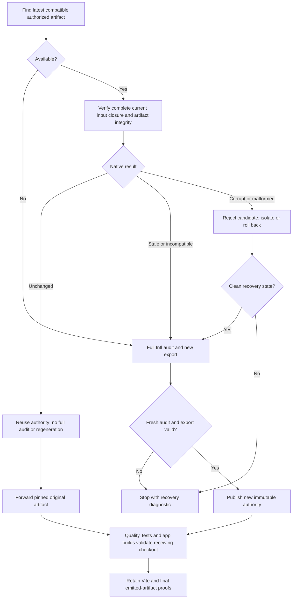
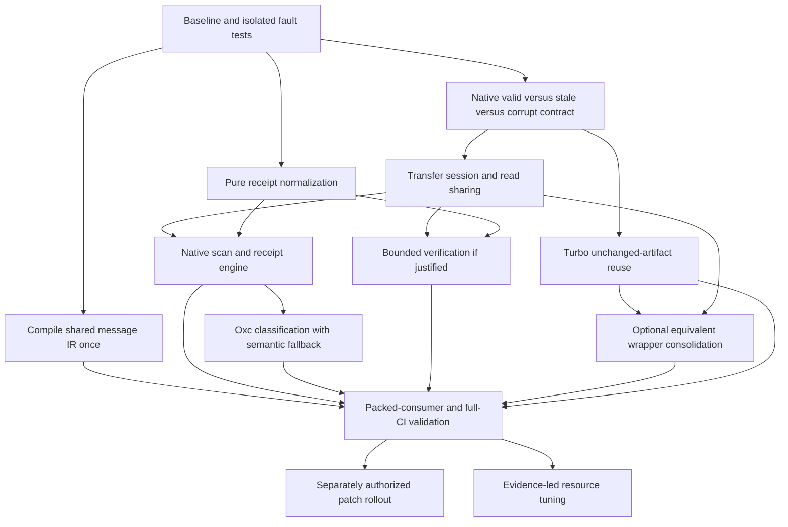
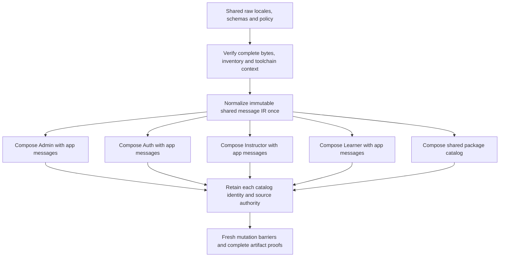

# Accepted visual plan source

This is the verbatim MDX accepted before execution. Its component syntax is owned by vplan; it is stored as text because generic MDX formatting changes component/list boundaries. Extract the fenced contents to a .mdx file and run `vplan check` or `vplan render` to view it. Execution status and updates live in EXECUTION.md.

````text
# Complete Intl CI improvement plan

Implementation plan for `openmirai/mirai-intl` and `openmirai/fe-mirai-org-turbo`, based on the captured PR #1777 research. Primary requirement: unchanged Intl inputs reuse valid authority and skip full audit. Planning only; nothing below is implemented or authorized for execution yet.



<Callout type="decision">
A corrupt cache candidate is rejected, then preparation may run one clean full audit; only independently validated new authority is accepted. A valid hit skips full Intl source auditing, semantic analysis, compilation and regeneration. It still checks freshness and integrity for all five catalogs. “Latest” chooses a candidate; content proves validity. Any compatible library release must be a patch release.
</Callout>

<Callout type="note">
“Corrupt or malformed” is a hypothetical candidate-rejection case in this design. It was not the diagnosis of the linked PR preparation job, which succeeded. A clean recovery does not inherently require a code change or another push.
</Callout>

## Delivery sequence and ownership

<Phase title="Lock the baseline and repair equivalence fixtures" status="planned">
Owner: both repositories. Establish the oracle before changing behavior.

- Use isolated workspaces at immutable input revisions; follow each repository's instructions and preserve other agents' work.
- Freeze exact package bytes, Node/pnpm/compiler identities, locale/source inventory and generated artifacts.
- Repair the historical empty-value/invalid-ICU fixtures: change one value while retaining every other key.
- Add independent spies/counters for full authorization, TypeScript setup, compile and emission; do not rely only on CLI summaries.
- Capture real Linux ARM64 CPU/cgroup/RSS/storage resources and phase profiles when access and execution are approved.

<Checklist title="Phase gate">
- [ ] Baseline rejects every strictness fault for the intended reason
- [ ] Actual runner limits known or explicitly recorded as unavailable
- [ ] Cold/warm measurements and raw evidence retained
- [ ] No active worktree used for experiments
</Checklist>
</Phase>

<Phase title="Define native authority reuse outcomes" status="planned">
Owner: mirai-intl. Reuse its complete validation contract instead of creating a Turbo path-filter approximation.

- Expose distinguishable valid, stale, incompatible, missing and corrupt outcomes through an internal or additive compatible contract.
- A hit binds all catalog identities, current source/config/dependency/compiler evidence and selected artifact bytes.
- Preserve initial/final live-state checks and complete catalog/source rediscovery, including negative resolution evidence.
- Treat source changes as a reuse miss. Reject malformed/tampered cached authority explicitly, then allow one clean producer audit after safe isolation or rollback.
- Keep the importer strict; classify errors for orchestration without treating lock, rollback or unreadable-source failures as ordinary misses.
- Return actual completed coverage and forbidden-work counters; semantic receipt counters from earlier authorization are not current execution counters.

<Checklist title="Phase gate">
- [ ] Different commit labels with identical relevant inputs can reuse authority
- [ ] Same commit label with changed bytes cannot reuse it
- [ ] Unsupported schema/compiler identities cannot produce a hit
- [ ] Existing CLI/API behavior remains compatible
</Checklist>
</Phase>

<Phase title="Add Turbo reuse-first preparation and cross-run delivery" status="planned">
Owner: Turbo. Deliver the required audit skip before discretionary tuning.

- Discover candidates from completed successful trusted producer runs; use a bounded search and select the latest compatible candidate.
- Pin original run/attempt, artifact identity and digest; never pass a moving latest pointer to consumers.
- Restore/validate against the actual checked-out tree. On a hit, forward the original validated artifact or its exact bytes, without re-exporting.
- On missing/expired/stale/incompatible authority, run full current authorization and export new authority; invalid current input must still fail.
- On rejected corrupt prior-run authority, discard its isolated stage or prove rollback before the same one-audit fallback. Preserve rejection diagnostics and tracked-generation drift checks.
- Keep recovery centralized in preparation. Downstream damage to a pinned artifact is an integrity error, never a reason for every app to audit independently.
- Extend restoration beyond its current-run lookup for Quality, Tests, all four app builds and the separate release producer.
- Preserve digest mismatch rejection, native receiver checks and all five catalog identities. Keep zero-work predicates on reuse/consumer verification; report real authorization work honestly on a miss.

<Checklist title="Phase gate">
- [ ] Verified unchanged hit runs zero full audits and zero regeneration
- [ ] No import/verify/export/verify cycle on a hit
- [ ] Cold start, expired/stale/corrupt candidate safely takes one clean audit path
- [ ] Invalid current inputs, unsafe rollback and repeated fresh corruption still fail
- [ ] Cache-only corruption never requires a meaningless code push
- [ ] A docs-only change outside the native closure can reuse authority
- [ ] Trusted producer selection and pinned cross-run delivery are tested
</Checklist>
</Phase>

<Phase title="Share transfer verification sessions within each barrier" status="planned">
Owner: mirai-intl. Extend the existing workspace toolchain-sharing pattern to transfer.

- Share toolchain identity and regular-file read/hash promises within export's staged verification.
- Use separate sessions for import's pre-selector and post-install checks, and fresh observations for final barriers.
- Key reads by canonical root/path, read semantics and hash domain; compare every expected digest independently.
- Keep stat, lstat, realpath, link-target, missing-path and directory-inventory evidence distinct.
- Preserve archive closure, inactive-checkout contract, publication locks, rollback and recovery state.

<Checklist title="Phase gate">
- [ ] Shared file mutations between phases are rejected
- [ ] Conflicting expected hashes cannot share a cached success
- [ ] Read/hash counts fall without reduced coverage
- [ ] Every injected publication failure rolls back or retains explicit recovery state
</Checklist>
</Phase>

<Phase title="Remove repeated pure receipt normalization" status="planned">
Owner: mirai-intl. Reduce measured structural CPU work while preserving live source validation.

- Reuse validated immutable receipt structures within one operation; retain canonical bytes, named hashes and all cross-bindings.
- Never accept an external trusted flag or confer internal trust on a copied/mutated object.
- Separate pure structural work from source relationship checks that need fresh filesystem evidence.
- Benchmark separately from read/session changes so benefits and regressions are attributable.

<Checklist title="Phase gate">
- [ ] Tampered, cloned and malformed receipts retain the same rejection behavior
- [ ] Canonical/hash computation counts are measured
- [ ] CPU and p95 improve without unacceptable peak-memory growth
</Checklist>
</Phase>

<Phase title="Compile shared package messages once and compose each app" status="planned">
Owner: mirai-intl compiler internals, then Turbo dependency scheduling. This targets the actual raw mounts from packages/i18n.

- Produce one immutable normalized message IR per exact source-content and semantic context before, or single-flight across, app workers. Reuse ICU parse/contract inference/lowering and pure renderer computation.
- Key the IR by raw file inventory/bytes, schemas, locale policy, parser/compiler/formatter identity and plural-rule semantics. Do not trust package version or a self-consistent untrusted IR hash.
- Reuse existing composition safety rules while preserving current convention ownership, mount paths, collisions, exact replacements and consumer provenance.
- Link each app's own messages with the shared IR; recompute app catalog identity, ordered validator indices, hashes, descriptors and build tokens. First target byte-identical existing output.
- Retain all five source-authority checks. A shared-package receipt cannot replace an app's owner-project, import/provider or dynamic-use analysis.
- Extend trusted IR reuse into repeated fresh snapshot loading only after current input hashes and complete inventory match; final barriers reread live evidence. Zero compile counters do not prove zero ICU parsing.
- Evaluate shared renderer modules separately after IR parity; only adopt if existing runtime, archive and authority compatibility can be preserved in a patch. Exclude any breaking format migration.

<Checklist title="Shared compilation gate">
- [ ] Independent counters prove shared parse/normalize work occurs once per compatible identity
- [ ] All 3931 shared messages preserve full contracts and byte-identical first-stage app output
- [ ] Learner's three additional UI keys remain app-owned
- [ ] Different mounts, schemas, indices and app identities remain isolated
- [ ] Edited shared inputs invalidate every affected consumer, including during final barriers
- [ ] Forged/rehashed IR cannot confer authority; cold misses recompute safely
- [ ] Cold/warm auth, verify, import/export and critical-path savings measured separately
</Checklist>
</Phase>

<Phase title="Build a native scan and receipt engine with a measured JS control" status="planned">
Owner: mirai-intl. This is a concrete performance workstream, with adoption gated by parity and end-to-end results.

- Compare deduplicated JS and pooled JS against a Rust Node-API addon and one long-lived Rust worker per operation; avoid per-file processes or full AST serialization.
- Implement a workspace coordinator for bounded directory/read/hash batches and compact per-catalog evidence. Preserve fresh final observations and the exact existing discovery rules.
- Port receipt canonicalization only with byte-for-byte Unicode, ordering, number, schema and hash-domain parity; retain SHA-256 and all cross-bindings.
- Compile native binaries at library release time, starting with Linux ARM64 and macOS ARM64; keep compatible JS fallback for other supported hosts and missing binaries.
- Benchmark WASI as a separate portability target, including startup, host calls, memory, threads and filesystem behavior. Do not assume it beats native or JS.
- Bind a release-wide engine manifest and verify the loaded target binary against it. Preserve portable authority across equivalent Linux/macOS engines; a target-binary hash alone must not force cross-platform misses.
- Never swallow native validation errors through fallback; prove loader, manifest and binary tampering are rejected.

<Checklist title="Native engine gate">
- [ ] Exact inventory, canonical bytes, hashes and failure behavior match the oracle
- [ ] Mutation, rollback and malformed-input corpus passes on every engine
- [ ] CPU, logical/physical I/O, FFI/IPC and peak memory measured on real inputs
- [ ] Cold/warm median and p95 improve outside noise without weakened coverage
- [ ] Packed consumers work without compiling Rust in application CI
- [ ] Linux/macOS authority transfer remains portable with verified engine integrity
</Checklist>
</Phase>

<Phase title="Accelerate source classification with Oxc while retaining type semantics" status="planned">
Owner: mirai-intl. Reuse the native core, then tackle parsing separately from receipt-only verification.

- Parse/classify source in Rust using Oxc and return compact Intl facts, spans and conservative uncertainty markers.
- Differentially test the full TS/TSX/JS/JSX corpus, aliases, re-exports, provider boundaries, dynamic usage and hardcoded UI.
- Retain TypeScript owner-project batching and semantic fallback for every unsupported or ambiguous case; a parser is not a replacement for the current type/provider queries.
- Evaluate a native TypeScript semantic adapter separately when the required embedding APIs can be proven; TypeScript 7's release documents the stable-API limitation.
- Keep the existing analyzer as the oracle until equivalent diagnostics and complete authority evidence are demonstrated; no unproven narrower classification may grant a skip.

<Checklist title="Classification gate">
- [ ] No false inactive classification on the differential corpus
- [ ] Every supported source rejection survives engine selection
- [ ] Parser and semantic gains measured separately from verification-only paths
- [ ] Any eventual adoption remains an internal compatible patch
</Checklist>
</Phase>

<Phase title="Bound verification scheduling and aggregate I/O" status="planned">
Owner: mirai-intl. Implement only when profiles show an opportunity after deduplication.

- Replace shared mutable catalog indices with immutable per-task indices and deterministic output order.
- Bound both active catalogs and total leaf I/O; start comparisons at 1 and 2 catalogs, then test 4 only with measured headroom.
- Finish initial work before final barriers; collect every catalog failure and leave no work running after return or rollback.
- Measure per-catalog cost before choosing weights; source count alone poorly predicts large receipt work.
- Avoid assuming async reads parallelize synchronous hashing or canonical encoding. Additional CPU workers require separate startup/serialization/RSS evidence.

<Checklist title="Phase gate">
- [ ] Active work never exceeds configured limits
- [ ] Diagnostics retain the correct catalog under out-of-order completion
- [ ] Shared-file and inventory mutations remain rejected
- [ ] Full-input median/p95 and peak RSS justify the concurrency choice
</Checklist>
</Phase>

<Phase title="Consolidate the extra wrapper pass only with equivalent native coverage" status="planned">
Owner: library first, Turbo second. This is conditional, not a pre-approved deletion.

- Add a native completed-transfer summary and final live-state barrier that cover the later standalone verification observation.
- Export must retain staged byte integrity and post-pack freshness coverage; import retains pre-selector and post-install guarantees.
- Differentially compare transfer-plus-wrapper with the proposed consolidated path under deterministic mutations.
- Only then replace the extra subprocess while retaining exact catalog identities, report semantics and independent forbidden-call checks.
- Keep Vite buildStart and final emitted-byte proofs; they protect later stages and different artifacts.

<Checklist title="Phase gate">
- [ ] Every removed check has an explicit retained equivalent
- [ ] No success is inferred solely from archive existence, metadata or digest
- [ ] Native summary proves completed checks, not planned work
</Checklist>
</Phase>

<Phase title="Validate package adoption, full CI and rollback" status="planned">
Owner: both repositories. Separate local package validation, publication and consumer rollout.

- Test exact packed candidate bytes in disposable Turbo consumers before any publication.
- Keep existing authority/CLI compatibility; any eventual release is patch-only, never a major release.
- Once separately authorized, publish the compatible patch and update exact Turbo pins, lockfile and compiler-bound generated authority.
- Preserve `.nvmrc= lts/*`, all five catalogs, strict artifact digest and zero-work gates.
- Validate Quality, Tests and Admin/Auth/Instructor/Learner production-mode builds on hit and miss paths; verify final client/worker bytes and proofs.
- Rollback restores prior package pins and workflow behavior; incompatible old authority becomes a miss, never an accepted fallback.

<Checklist title="Phase gate">
- [ ] Packed-consumer tests pass before publication
- [ ] All four app builds and final proofs pass
- [ ] Cold and warm hit/miss behavior is demonstrated
- [ ] Rollback and artifact expiry behavior are proven
- [ ] Publication, workflow execution and deployment remain separately authorized actions
</Checklist>
</Phase>

<Phase title="Resolve remaining tuning opportunities from measurements" status="planned">
Owner: library scheduling plus Turbo/infrastructure. Every investigated option has a disposition.

- Sweep existing catalog, semantic, libuv and read limits; authorization concurrency and conditional larger-first scheduling already exist.
- Evaluate faster CPU, runner size and storage only after verifying actual resources; compare p95 and cost per successful pipeline.
- Measure dependency restoration/cache save costs separately from Intl work; avoid destructive cache-clearing on shared hosts.
- Compare artifact encoding/compression only if transfer or parsing becomes material; preserve every selected member and archive safety limit.
- Defer partial reauthorization of changed catalogs until a complete dependency graph and full-authorization oracle prove invalidation.
- Inspect duplicate Quality lint as an adjacent low-priority task; it was not the observed PR critical path and must retain coverage if consolidated.
</Phase>

## Coverage and dependencies



Reuse must not wait for optional concurrency, runner changes or partial incremental authorization. Shared-IR compilation and native scan/receipt prototypes can proceed as separate measured workstreams after baseline fault tests; each must earn adoption independently. Foundational API support can be tested locally with packed packages while publication remains gated. Keep separate changesets/PRs for behavior, read sharing, normalization and concurrency so regressions can be attributed and rolled back.

## Proposed file changes

Existing paths below were identified in the research. New helper/test filenames are proposed and should follow repository conventions during implementation.

### mirai-intl

<FileTree>
- modify packages/compiler/src/authority-bundle.ts -- typed outcomes and phase-local transfer sessions
- modify packages/compiler/src/check-receipt.ts -- reusable verification contexts and bounded scheduling
- modify packages/compiler/src/integrity-identity.ts -- scoped identity and hash sharing
- modify packages/compiler/src/authorization-snapshot.ts -- pure immutable normalization reuse
- modify packages/compiler/src/verify.ts -- compatible public surface if needed
- modify packages/compiler/src/cli.ts -- structured outcomes and measured counters
- modify packages/compiler/src/workspace-resources.ts -- global bounded work budgets
- modify packages/compiler/src/source-discovery.ts -- engine-backed exact inventory
- modify packages/compiler/src/canonical.ts -- optional equivalent native path
- modify packages/compiler/src/catalog.ts -- consume trusted normalized mounted messages
- modify packages/compiler/src/parser.ts -- reusable parse and contract representation
- modify packages/compiler/src/compile.ts -- per-app linking and layout after shared normalization
- modify packages/compiler/src/compose.ts -- preserve ownership and mount semantics
- modify packages/compiler/src/emit.ts -- memoize pure shared renderers, retain app wrappers
- add packages/compiler/src/compiled-fragment.ts -- proposed sealed IR and identity
- add packages/compiler/test/compiled-fragment.test.ts -- proposed reuse and consumer isolation corpus
- add packages/compiler/src/native-engine.ts -- proposed internal engine adapter
- add crates/intl-scan/ -- proposed Rust core and Node-API or worker boundary
- add packages/compiler/test/native-engine-parity.test.ts -- proposed differential and fault corpus
- add benchmarks/native-engine.ts -- proposed native, JS and WASI comparison harness
- modify benchmarks/receipt-parity.ts -- isolate intended locale faults
- modify benchmarks/receipt-verification.ts -- repeatable verification comparisons
- modify benchmarks/receipt-pipeline.ts -- complete hit/miss and transfer measurements
- modify packages/compiler/test/authority-bundle.test.ts -- transfer and rollback equivalence
- modify packages/compiler/test/strict-receipt-verification.test.ts -- freshness and zero-work invariants
- modify packages/compiler/test/cli.test.ts -- native outcome and counter compatibility
- add packages/compiler/test/authority-reuse.test.ts -- proposed reuse and cross-phase cases
</FileTree>

Catalog validation, source semantics, Vite build checks and emitted-proof contracts remain strict. Native internals and shared compilation below must demonstrate equivalent output and complete rejection coverage; none is presumed a measured CI bottleneck. Rust directory/package names are proposed and must follow library conventions at implementation time.

### fe-mirai-org-turbo

<FileTree>
- modify .github/workflows/validate.yml -- reuse-first producer and immutable artifact outputs
- modify .github/workflows/release-build.yml -- matching release-producer behavior
- modify .github/workflows/dispatch-builds.yml -- propagate pinned authority through app fan-out
- modify .github/workflows/build-worker.yml -- consume original-run authority and retain proofs
- modify .github/actions/restore-intl-authority/action.yml -- strict cross-run artifact resolution
- modify .github/scripts/intl-authority.sh -- native outcomes and conditional proven consolidation
- add .github/scripts/find-intl-authority.mjs -- proposed bounded candidate discovery
- add .github/scripts/find-intl-authority.test.mjs -- proposed provenance and lookup tests
- modify .github/scripts/intl-authority-transfer.test.mjs -- hit/miss/error and zero-work gates
- modify tools/start-runtime-host/src/artifacts/__tests__/built-artifact-ci-contract.test.ts -- actual workflow and proof wiring
- modify pnpm-workspace.yaml -- exact compatible patch tarballs when authorized
- modify pnpm-lock.yaml -- matching package integrities
- modify docs/intl-0.3-source-and-ci-flow.md -- reuse contract and troubleshooting
- modify packages/i18n/package.json -- only if shared IR producer integration requires it
- modify apps/*/mirai-intl.config.json -- only if additive IR adoption requires it; preserve mount compatibility
</FileTree>

All normal producers/consumers must be audited together, including workflow-call/manual-dispatch wiring. Emergency workflows keep their existing strict behavior unless explicitly brought into this change; do not silently broaden or weaken their contracts. Compiler identity changes may require generated receipt updates through the supported generation workflow, never hand-edited authority hashes.

## Reuse contract and failure behavior

| Condition | Required action | Proof required |
|---|---|---|
| Valid unchanged closure | Reuse; zero full audit/semantic/compile/emission | Native freshness, all catalog identities and artifact integrity |
| Different SHA, identical relevant inputs | Reuse after validation | Content closure; labels are not proof |
| Same SHA, changed input bytes | Reject reuse | Fresh source/config/dependency/generated evidence |
| Relevant inputs changed | Full current authorization | Old authority is not accepted; invalid new input fails |
| Missing/expired artifact | Full current authorization | No unaudited success |
| Incompatible compiler/schema | Explicit miss and fresh authorization | No weakening of compatibility checks |
| Tampered/malformed/incomplete prior-run candidate | Reject; isolate or prove rollback; full current audit once | New independent authority; retain integrity diagnostic |
| Damaged fresh export or pinned downstream artifact | Fail producer/consumer; no per-app audit loop | Original artifact identity and actionable operational diagnostic |
| Fresh audit changes tracked generation | Preserve generated-drift failure | Reviewed regeneration/synchronization may require a commit |
| Candidate listing changes during run | Continue only with pinned identity | Original run/attempt, artifact ID and digest |
| API/auth/rate-limit failure | Explicit infrastructure failure or validated fallback | Never misclassify an error as a hit |
| Restored receiver changes before build | Reject through consumer freshness checks | No global cached success |

Use trusted successful producer runs and a bounded lookup. Metadata may filter candidates; it cannot bypass native source and archive validation. Restoring generated bytes is permitted; regenerating them on a valid hit is not. Forward the exact validated archive without adding a new export/verification cycle.

## Strictness equivalence matrix

Every row is a required implementation gate. Existing tests were inspected during research; new optimizations have not been implemented or tested.

| Rejection family | Test cases | Required evidence |
|---|---|---|
| Required English and Thai | Remove each required locale, nested file or shared mount | Direct validator and reuse miss/failure |
| Nested key completeness | Missing/extra leaf or object; empty/whitespace and wrong-kind values | Single-fault fixtures preserving unrelated keys |
| ICU and message contracts | Malformed syntax; valid syntax with incompatible parameters/rich-message contracts | Intended diagnostic, not masked missing-key rejection |
| Source usage | Unknown references, unsupported dynamic use, supported hardcoded UI cases | Full-audit oracle; conservative classifier fallback retained |
| Source universe | Changed/deleted/new relevant file; ownership/include/exclude; added/removed catalog | Fresh complete inventory, initial and final phases |
| Import resolution | Negative lookup becomes present; nearer manifest; exports/types/conditions; symlink retarget | Path/type/realpath/control evidence stays distinct |
| Config, dependencies and compiler | Raw/canonical manifest changes; lockfile/importer; transitive controls; compiler/ABI/TS/ICU/lib bytes | Existing binding scope retained across every phase |
| Generated artifacts | Missing/tampered pointer, receipt, facade, payload; unexpected build/member | Reject affected authority; clean producer regeneration must satisfy drift gate |
| Authority bundle | Stale/incomplete/corrupt selector, classifier, receipt or set; wrong cross-binding | No partial-set salvage; only independent clean producer authorization |
| Clean recovery | Corrupt cache with valid and invalid current sources; fresh export corrupt again | At most one clean audit, correct diagnostic, no unaudited success |
| Archive safety | Extra/missing/duplicate/traversal/link entries; size/count limits; digest mismatch | Reject before accepting authority; confined publication |
| Mutation barriers | Shared file changes between catalog checks; changes before final/after install | Fresh observations, never initial cached bytes |
| Rollback | Failure after every install step; failed rollback; active writer/recovery state | Prior state restored or explicit recovery preserved |
| Concurrency | Out-of-order completion, multiple failures, shared expected-hash conflicts | Correct catalog association, global bounds, no late work |
| Reuse across runs | Different labels, same labels with different bytes, expiry, moving latest, wrong producer | Immutable provenance plus native verification |
| Verification zero work | Exactly Admin/Auth/Instructor/Learner/shared verified | Independent forbidden-call instrumentation and counters |
| Shared locale IR | Missing locale/key, changed source/schema/plural policy, concurrent reuse, forged recomputed hashes | Full validator parity and trusted derivation, complete input evidence |
| App composition | Different mounts/IDs, inserted keys, collisions/replacements, Learner-only UI keys | Correct descriptors, indices, provenance and app-specific source authority |
| Native filesystem | Hidden regular files, exact exclusions, symlinks, ignored/untracked additions, permission and race failures | Exact inventory and path evidence across engines |
| Native encoding | NFC, astral/BMP ordering, lone surrogates, escaping, negative zero, malformed structures | Exact canonical bytes, SHA-256 and rejection parity |
| Oxc classification | Parse recovery, provider/type aliases, re-exports and unsupported syntax | No false inactive result; conservative semantic fallback |
| Engine identity | Mutated binary/loader, unsupported target, failed native validator | Stale authority rejected; validated JS fallback only |
| Final outputs | Changed/missing JS/map/module/target; stale copied proof; cached build outputs | Actual client/worker emitted bytes remain bound |

<Callout type="risk">
Historical empty-translation and invalid-ICU benchmark cases replaced a 1000-key locale with one key. Missing-key failure masked the intended predicate. Repair these first. Structural validation proves completeness and contracts within supported scope; it does not prove linguistic translation quality.
</Callout>

Compare baseline and candidate against identical authored states and deterministic mutation interleavings. Each compiler generates its own authority because compiler identity changes receipt hashes; compare diagnostics, coverage and normalized contracts across versions. Within one engine, concurrency/dedup must preserve deterministic selected authority and authored bytes. Keep V2 compatibility tests separate from native V3 transfer and zero-work expectations.

## Benchmark and observability plan

| Dimension | Required experiment | Report |
|---|---|---|
| End-to-end reuse | Hit, no artifact, stale input, incompatible compiler, corrupt bundle | Full wall time, audit decision and failure reason |
| Cache state | Fresh process/workspace and warm repeats | At least 10 samples/state; median, p95, SD/variance |
| Resource identity | Identical Linux ARM64 runner/cgroup/Node/pnpm/input | CPU, memory, storage, dependency/package digests |
| Per-phase work | Discovery, load/compile, TS setup, classification, semantics, receipts/barriers | Exclusive spans and per-catalog attribution |
| Transfer | Manifest/copy/verify/pack; extract/pre-install/post-install; upload/download | Logical bytes, physical I/O where available, latency |
| CPU and workers | Profiles, Program/module counts, startup, serialization, GC | CPU seconds, main/native work, duplicated setup |
| Memory and filesystem | Process tree/cgroup high-water RSS, read/hash/stat counts | Peak memory and logical versus physical bytes distinguished |
| Build proof | Vite checks, dependency receipts, final target scans and proof writes | Actual final outputs and per-stage cost |
| Scheduling | Catalog limits 1/2, then 4 only with headroom; aggregate I/O sweep | Median/p95, active limits, failure behavior and peak RSS |
| Engine comparison | Baseline/dedup/pooled JS, Rust addon/child, forced WASI | Total phase time, crossings/copies, engine identity and strictness |
| Shared compilation | Cold fragment miss, valid hit, changed shared/app inputs | Actual compile calls, cache provenance, wait time, identical outputs |
| Pipeline impact | Preparation plus longest Quality/Tests branch; staging app tail | Critical-path savings, not summed parallel-job savings |

Do not clear shared host caches, change production runners or rerun workflows during planning. Alternate candidate order on identical resources; collect uninstrumented timings separately from diagnostic profiles. “Cold” must state whether it means process-cold or filesystem-cold. Lifetime maxRSS is not incremental allocation; shared warm-process observations are correlated.

Proposed CI summaries expose audit reused/executed, miss/rejection reason, original producer/artifact digest, all catalog identities, input-binding identity, actual forbidden-call counts and timings. Record evidence for successful and failed paths without using report existence as proof.

## Measured baseline and expected benefit

<Stat>
- Full authorization: 29–33 s -- observed preparation steps
- Export and verify: 78–80 s -- observed preparation wrapper
- Consumer authority restoration: 87–100 s -- observed PR and app jobs
- Actual download: about 1 s -- observed artifact download
</Stat>

The linked preparation was 149 seconds including 17 seconds waiting for a runner. Export alone was about 55 seconds; the subsequent workspace verification about 24 seconds. That wrapper tail is an opportunity envelope, not a proven redundant pass or forecast saving.

<Matrix>
| Staging app | Authority restore | Build with proofs | Finalized modules |
|---|---|---|---|
| Admin | 87 s | 324 s | 1373 |
| Auth | 100 s | 42 s | 133 |
| Instructor | 89 s | 212 s | 941 |
| Learner | 88 s | 213 s | 1062 |
</Matrix>

All four observed builds passed on cache misses and reported zero semantic builds at finalization. Tests took 580 seconds in the final PR run; Quality and Tests overlap. Runner suffixes are project names, not verified hardware sizes. AWS resource access expired during research, so actual CI CPU/RSS/storage profiles remain a measurement gate.

<Compare>
## Required reuse and shared-work fixes (pick)
- pro: Skip full auditing when input closure is unchanged; reduce repeated transfer/receipt work on every consumer.
- pro: Existing native verification and toolchain-sharing patterns provide a starting contract.
- con: Import/verification is already expensive; a hit needs full-path benchmarking, not just a cache-hit flag.
## Conditional tuning
- pro: Bounded scheduling, faster CPU or storage may improve the remaining measured workload.
- con: Async reads do not parallelize synchronous hashing/JSON; worker setup and memory can erase gains.
- con: Artifact compression has little current transfer headroom; partial changed-catalog reauthorization has high invalidation complexity.
</Compare>

A fresh published-0.3.29 synthetic experiment measured cold verification median 460.63 ms / SD 20.03 ms and warm 406.15 ms / SD 6.55 ms, with ten samples each. Diagnostic verification made 913 reads returning 96.3 MB and 1283 hash updates over 100 MB. Canonical encoding stacks accounted for about 34% and synchronous hash stacks about 9% of sampled main-thread time. This was M4 Pro/macOS/Node 24.18.0 with five trivial source files; it cannot predict Linux CI speedups. CI used Node 24.21.0. Full source inventory in the real receipts was 5117 rows, not just the 172 semantic-file rows rendered by the CLI.

| Workstream | Expected benefit | Risk | Confidence now |
|---|---|---|---|
| Unchanged-artifact reuse | Mandatory full-audit skip; full-path savings unmeasured | Medium | Contract clear; implementation unproven |
| Transfer sessions and read/hash sharing | Repeated work inside 55 s export / 62–73 s import | Medium | Duplication established; speedup unknown |
| Pure normalization | Reduce prominent local structural CPU work | Medium | Local profile supports investigation |
| Shared message IR | Avoid up to 15724 repeated shared-message lowering occurrences on a full cold compile; inference reuse may also help verification | Medium-high; compiler/linker and trust-boundary work | Artifact duplication confirmed; time savings unmeasured |
| Native Rust scan/receipt engine | Lower repeated allocation, byte processing and crossings | Medium-high; compiler internals and distribution | Concrete prototype plan; no candidate measurement |
| Oxc classification | Faster fresh-audit syntax/scope work | High; preserve semantic fallback | Official engine architecture; Intl parity unproven |
| WASI alternative | Portable native-core fallback | Medium-high; filesystem/thread parity | Benchmark target, no speed claim |
| Native TypeScript semantics | Potential semantic setup/query gain | High; embedding API compatibility | Separate feasibility gate |
| Bounded verification | Overlap remaining waits if measured | Medium | Depends on CPU/I/O/RSS balance |
| Wrapper consolidation | About 24 s per reached stage before retained-equivalent cost | Medium-high | Equivalence not yet established |
| Existing worker/I/O tuning | Improve tails or reduce contention | Low-medium | Existing concurrency already present |
| Runner/storage/dependency cache | Improve CPU, I/O and setup cost | Operational | Resource profile unavailable |
| Artifact size/transfer | Small network upside; potential parse/disk benefit | Medium for format changes | Transfer currently low priority |
| Partial changed-catalog audit | Future avoided semantic work | High | Defer until complete invalidation oracle |

Do not add overlapping savings or promise a percentage before identical-input A/B results. Reject throughput improvements that weaken strictness, exceed resource budgets or produce unacceptable p95 regressions.

## Shared package: measured artifact facts and intended flow

| Observation | Evidence and limit |
|---|---|
| Shared message set | 3931 exact keys/contracts/renderers appear in Admin, Auth, Instructor, Learner and shared catalog |
| Cold compilation opportunity | 19655 shared-message occurrences minus 3931 unique messages equals 15724 repeated occurrences; code-derived avoided work, not measured calls or CI savings |
| Total artifact messages | 32697 occurrences across five catalogs; not a unique-workspace key count |
| Raw mounted input | 494 files, 525108 bytes, identical in original/final tested PR trees and captured staging |
| Existing caching | Per-loaded-catalog WeakMap and source-level fragments; no cross-app compiled-IR contract |
| Verification nuance | compile=false still loads fresh messages and infers ICU contracts; profile parse/inference separately |
| Legitimate per-app work | Different catalog IDs, hashes, validator indices, provenance, source authority and final outputs |



This compiles shared message semantics once; it does not copy a finished shared descriptor into every app. The npm compiler is already shipped as built dist. Per-app module initialization, Vite work and source authorization are separate. See the shared-compilation appendix for exact artifact members, differing validator-index example and full parity matrix.

## Source anchors and research artifacts

| Surface | Exact research reference |
|---|---|
| Native transfer and publication | [authority-bundle.ts at 0.3.29 source](https://github.com/openmirai/mirai-intl/blob/1aac3ee03b6f88a72f361ff5e0ad5066381ca1aa/packages/compiler/src/authority-bundle.ts#L363) |
| Workspace sessions and final barriers | [check-receipt.ts](https://github.com/openmirai/mirai-intl/blob/1aac3ee03b6f88a72f361ff5e0ad5066381ca1aa/packages/compiler/src/check-receipt.ts#L1391) |
| Canonical receipt normalization | [authorization-snapshot.ts](https://github.com/openmirai/mirai-intl/blob/1aac3ee03b6f88a72f361ff5e0ad5066381ca1aa/packages/compiler/src/authorization-snapshot.ts#L7645) |
| Existing resource-aware authorization | [cli.ts](https://github.com/openmirai/mirai-intl/blob/1aac3ee03b6f88a72f361ff5e0ad5066381ca1aa/packages/compiler/src/cli.ts#L386) |
| Turbo five-catalog wrapper | [intl-authority.sh](https://github.com/openmirai/fe-mirai-org-turbo/blob/12fa062f26e8117ae0f3fd1eda60b5d7a46682b2/.github/scripts/intl-authority.sh#L9) |
| Current-run restoration surface | [restore action](https://github.com/openmirai/fe-mirai-org-turbo/blob/12fa062f26e8117ae0f3fd1eda60b5d7a46682b2/.github/actions/restore-intl-authority/action.yml#L13) |
| Preserve final artifact proof | [multi-target finalizer](https://github.com/openmirai/mirai-intl/blob/1aac3ee03b6f88a72f361ff5e0ad5066381ca1aa/packages/compiler/src/proof.ts#L2286) |
| Raw mounted locale loading | [catalog.ts](https://github.com/openmirai/mirai-intl/blob/1aac3ee03b6f88a72f361ff5e0ad5066381ca1aa/packages/compiler/src/catalog.ts#L3107) |
| Per-message compilation and app layout | [compile.ts](https://github.com/openmirai/mirai-intl/blob/1aac3ee03b6f88a72f361ff5e0ad5066381ca1aa/packages/compiler/src/compile.ts#L428) |
| Fresh verification still loads locale contracts | [check-receipt.ts](https://github.com/openmirai/mirai-intl/blob/1aac3ee03b6f88a72f361ff5e0ad5066381ca1aa/packages/compiler/src/check-receipt.ts#L1113) |
| Repair masked test cases | [receipt-parity.ts](https://github.com/openmirai/mirai-intl/blob/1aac3ee03b6f88a72f361ff5e0ad5066381ca1aa/benchmarks/receipt-parity.ts#L36) |

[Shared compilation research and exact counts](shared-compilation.md) · [Reproducible artifact inspection](shared-artifact-inspect.py) · [Verified count results](shared-artifact-inspection.json) · [Native acceleration and recovery details](native-and-recovery.md) · [Full research report](research.md) · [Exact source/test inventory](library-source.md) · [Turbo call-site inventory](turbo-source.md) · [Benchmark methodology/results](benchmark-results.md) · [Raw evidence and benchmark commands](evidence.zip)

Evidence is the 10 September 2026 research snapshot: published library 0.3.29 at `1aac3ee`, final PR head `12fa062`, tested merge `b973ed9`, staging `993e382`. Local checkouts were older 0.3.28 and were preserved. Refresh remote revisions before implementation; do not execute changes against stale local assumptions.

## Completion and approval boundary

<Checklist title="Everything required before calling the work complete">
- [ ] Explicit implementation approval received
- [ ] Unchanged valid artifact skips every full audit and regeneration call
- [ ] Missing/stale/incompatible/corrupt candidates recover through one clean audit where safe
- [ ] Rejected authority is never accepted; invalid current inputs and unsafe recovery fail
- [ ] All five catalogs and all requested source/locale/integrity rejection cases pass
- [ ] Cross-run artifact identity, provenance and digest are pinned and tested
- [ ] Shared-read/normalization changes preserve initial/final/publication barriers
- [ ] Concurrency and aggregate I/O remain bounded with deterministic failures
- [ ] Every removed pass has demonstrated retained coverage
- [ ] Cold/warm hit/miss benchmarks include variance, peak memory and critical path
- [ ] Quality, Tests and all four app final artifact proofs pass
- [ ] Rollback, artifact expiry and compatibility behavior are demonstrated
- [ ] Native/JS/WASI and classifier parity gates pass before engine adoption
- [ ] Shared package compile-once behavior is proven with independent counters
- [ ] Any eventual library release is patch-only
- [ ] Other agents' work and unrelated changes remain intact
</Checklist>

<Callout type="note">
This request creates the vplan only. No implementation, commit, push, publication, runner change, workflow rerun or deployment is included in this turn. Review the plan first; execution and consequential rollout actions remain gated by explicit authorization.
</Callout>

````
