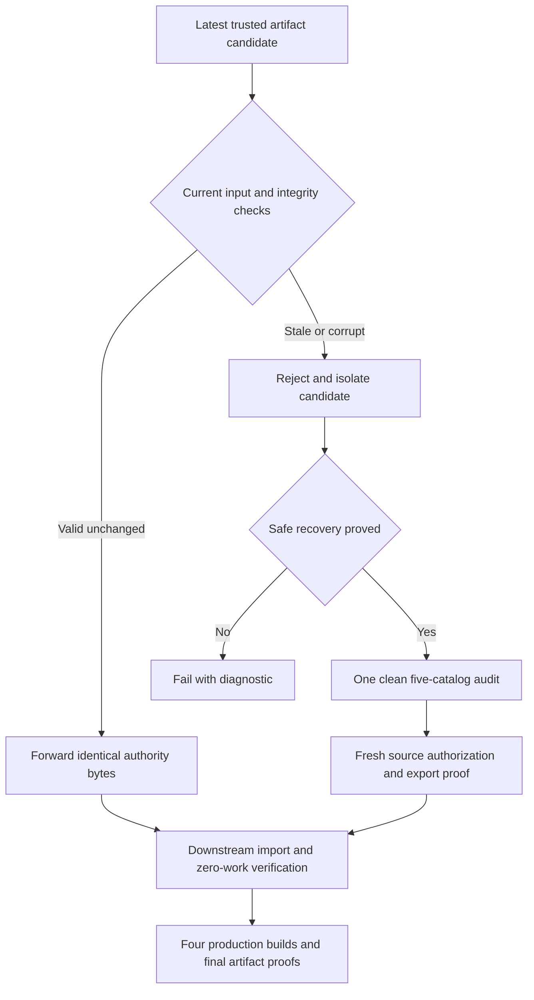

# Visual execution checkpoint

Extract the fenced MDX and validate with `vplan check`; this updates execution status without replacing the accepted baseline.

````text
# Intl CI optimization execution

Production-ready Rust and ordinary Turbo CI adoption remain the goal. This execution view follows the accepted plan; implementation and CI are authorized. Package publication, merges and runner infrastructure changes require separate approval.

<Callout type="decision">
Corrected library source: `37a8628f66cd793330db2d5a163287f8454182a8`. Turbo is pushed at `39d6a44fafb0b17726710a411dc80a126109f00f`; completed preparation/verification measurements remain bound to prior911 onto staging `f730f7b4bbd866bb55ff103876bb1c8d912e8015`. No package has been published or PR merged.
</Callout>



<Phase title="Authority reuse and bounded shared work" status="done">

- Valid hits skip audit and regeneration; unsafe recovery fails.
- Phase-scoped reads and hashes retain fresh final mutation barriers.
- The coordinator parses shared message semantics once; every catalog keeps its own descriptors and authorization.
- Node-API scanning and receipt processing use bounded queues and workers. TypeScript semantic checks remain.

</Phase>

<Phase title="Stable translation identity across app releases" status="done">

<Matrix title="Generation and authorization are separate">

| Change | Generation | Authorization |
| --- | --- | --- |
| App version only | Stable bytes | Fresh manifest |
| Identical rerun | Stable bytes | Verified reuse |
| Locale or contract | Regenerate | Fresh audit |
| Source or toolchain | Keep if valid | Reject old authority |
| Artifact tampering | Reject candidate | Reject candidate |

</Matrix>

The version-only incident is recorded at Turbo `72dd09fd3b6e95e71ec7fbcf997f62313b624cfc`. Earlier full Turbo CI passed four version probes and retained eight final proof objects.

</Phase>

<Phase title="Close the real adapter source-analysis gap" status="done">

Actual Auth probes found unknown and unsupported dynamic calls skipped by the old generated-facade filter. The repair records conservative semantic activity for each source, binds its complete bytes and retains the supported TypeScript analysis.

<Checklist title="Correctness evidence">

- [x] All five real catalogs pass the corrected direct-CLI audit.
- [x] Thirteen new parity and receipt tests cover source retention, remount, reuse and tampering.
- [x] Forced-Rust packed, browser-recovery and diagnostic smoke checks pass.
- [x] Corrected current-staging packed Turbo passes all17 strictness probes.
- [x] Corrected native CI passes all eight targets and packed consumer.
- [x] Four production builds, eight final proofs and four version-only probes pass.

</Checklist>

</Phase>

<Phase title="Prove composition, portability and recovery boundaries" status="done">

<Checklist title="Exact candidate correctness evidence">
- [x] All70 generated files and3931 shared contracts per app match independent unshared generation.
- [x] Same authority passes forced-Rust Mac, Linux and Mac return without re-audit.
- [x] All33 forward faults and22 rollback faults preserve safe state; Node96/96 and Rust96/96.
- [x] Full candidate34506410455 passes all4 builds,17 strictness probes and4 version-only regressions.
</Checklist>

Full private consumer corpus is retained in Turbo only. Cross-platform transfer uses one packed fixture; full Turbo acceptance is a separate gate.

</Phase>

<Phase title="Measure corrected end-to-end preparation" status="active">

<Callout type="risk">
Earlier n10 workspace/preparation and n30 transport measurements are retained as historical evidence. They predate the adapter correction. The published compiler has less semantic coverage, so it is context, not an equivalent correctness control. Current local machine contention also excludes ongoing diagnostic durations from performance claims.
</Callout>

<Chart type="bar" title="Measured preparation, n10 per engine (seconds)">
| Statistic | Corrected Node | Rust |
| --- | --- | --- |
| Median | 80.6435 | 78.0115 |
| p95 | 81.3609 | 78.2603 |
</Chart>

Paired CI34506408677 passes:3.26% median improvement. Cold means fresh processes with unchanged OS caches. Workspace verify34510179246 passes:4.66% cold and6.34% warm median improvement, with Rust warm sampled memory higher. Combined workspace reuse34512294604 is running on911 but may reach its budget. Separate cold/warm profiles and historical context follow serially on the scheduling-only39d6a44 cohort; results across revisions are not pooled.

- Compare corrected Node and Rust on identical source, package content and runner resources.
- Measure full preparation and valid unchanged reuse in repeated counterbalanced blocks.
- Repeat fresh-process and persistent Node API workspace measurements after the source repair.
- Report median, variance, p95, peak memory and the actual pipeline critical path.
- Keep measurement checks and artifacts distinct from full PR acceptance.
- Failed CI34498088946 has confirmed AWS BUILD_TIMED_OUT at45min and no usable samples; no OOM claim. Split n10 measurements into paired preparation, historical context, workspace verify and workspace reuse, each with35min budget and evidence-upload headroom.

</Phase>

<Phase title="Approve and publish the compatible patch" status="planned">

- Review the exact corrected source and passed all-eight-platform package artifacts.
- Verify compatibility, strictness, packed consumption and current registry state.
- Local five-package dry-run preflight passes; publication remains unapproved.
- Request patch `0.3.30` publication approval after all gates pass; request merges separately.

</Phase>

<Phase title="Adopt in ordinary Turbo CI and prove completion" status="planned">

- Apply the prepared producer/consumer workflow patch after approved publication.
- Resolve real registry packages and regenerate lockfile and tracked controls through repository tools.
- Verify a clean producer and unchanged reuse, downstream zero-work checks and four production app builds.
- Complete the durable goal only when ordinary CI adoption is verified.

</Phase>

<FileTree>

- modify docs/plans/intl-native-ci/CURRENT.md -- resumable checkpoint
- modify docs/plans/intl-native-ci/EXECUTION.md -- chronological decisions and gates
- add docs/plans/intl-native-ci/evidence/semantic-source-repair.json -- corrected source evidence
- add docs/plans/intl-native-ci/proposals/ADOPTION.md -- ordinary adoption guidance

</FileTree>

````
